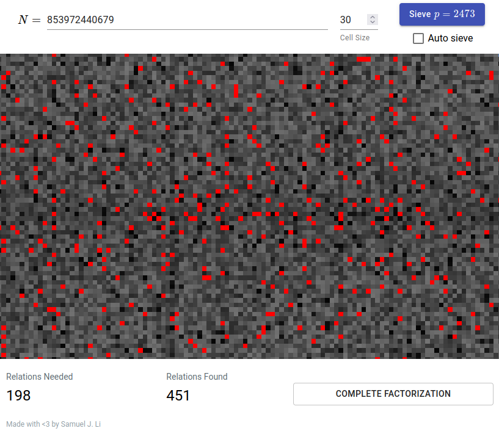
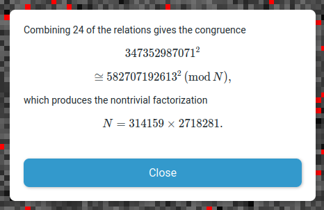

# Quadratic Sieve
A fast, interactive [visualization](https://samuelj.li/quadratic-sieve) of the [quadratic sieve](https://en.wikipedia.org/wiki/Quadratic_sieve) algorithm for integer factorization.

The calculator can comfortably factor 30-digit integer on desktop and mobile.
Sieving is done on the GPU in WebGL. The linear algebra step is done on the CPU.

## Explanation
* Each square represents a positive integer $x$. Hover over or tap the square to see which integer it represents.
* The brightness of each square represents the value $y$ of the polynomial $y = x^2 - N$, evaluated on that square.
* Each time the `Sieve' button is clicked, all values $y$ divisible by $p$ will be divided by $p$. This decreases the brightness of a periodic subset of squares.
* If a square is reduced to 1 at any point in the process, the corresponding $y$ must be *smooth* (have only small prime factors). These squares are highlighted in red.
* Once enough smooth values are collected, click the `Complete Factorization' button to finalize the process.

During the finalization step, an *exponent vector* is computed for each smooth value $y$. The $i$th entry of this vector is the exponent of the prime $p_i$ in the prime factorization of $y$. We can construct a square by finding a linearly dependent subset of exponent vectors modulo 2.

Finally, we obtain two distinct squares $a^2 \cong b^2$ modulo $N$. The factorization $a^2 - b^2 = (a+b) (a-b)$ is thus very likely to give a nontrivial factor of $N$.

## Tips
* If you can't get enough relations, decrease the cell size to increase the sieving area.
* On desktop, setting the cell size too small (~1 or 2) may cause most relations to fail verification. This occurs because the number of sieving cells exceeds the faithful range for representation of integers in WebGL.
